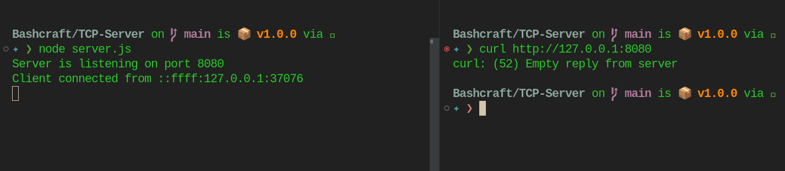

## TCP Server



```
git clone https://github.com/bandhan-majumder/Club-Task
cd TCP-Server
npm i
node server.js
```
### Open another terminal and try to add client with

```
curl http://127.0.0.1:8080
```

